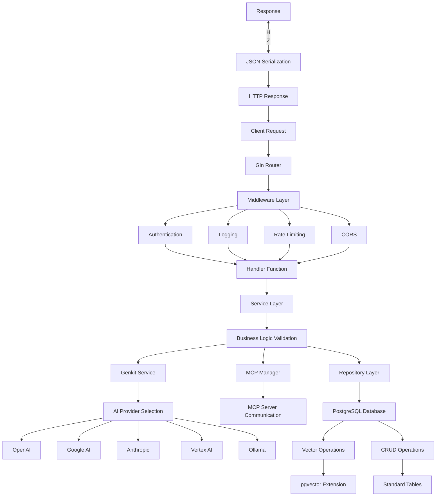
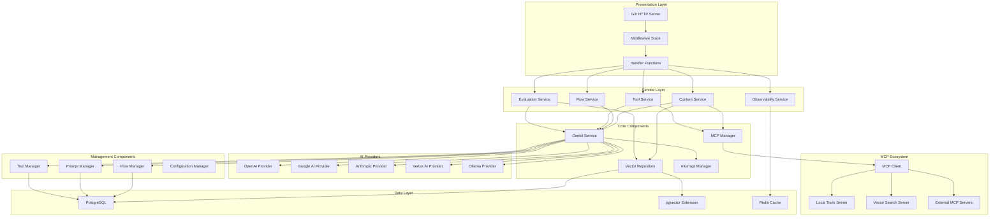
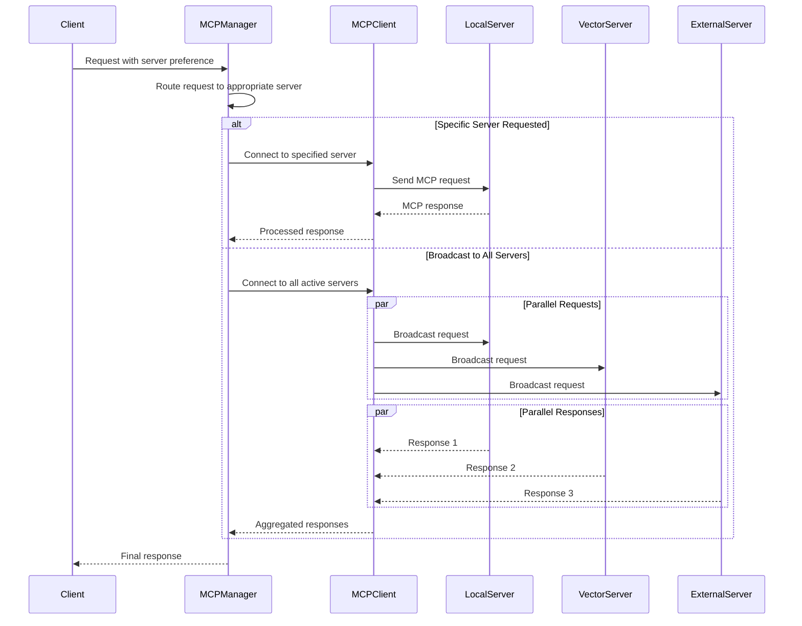
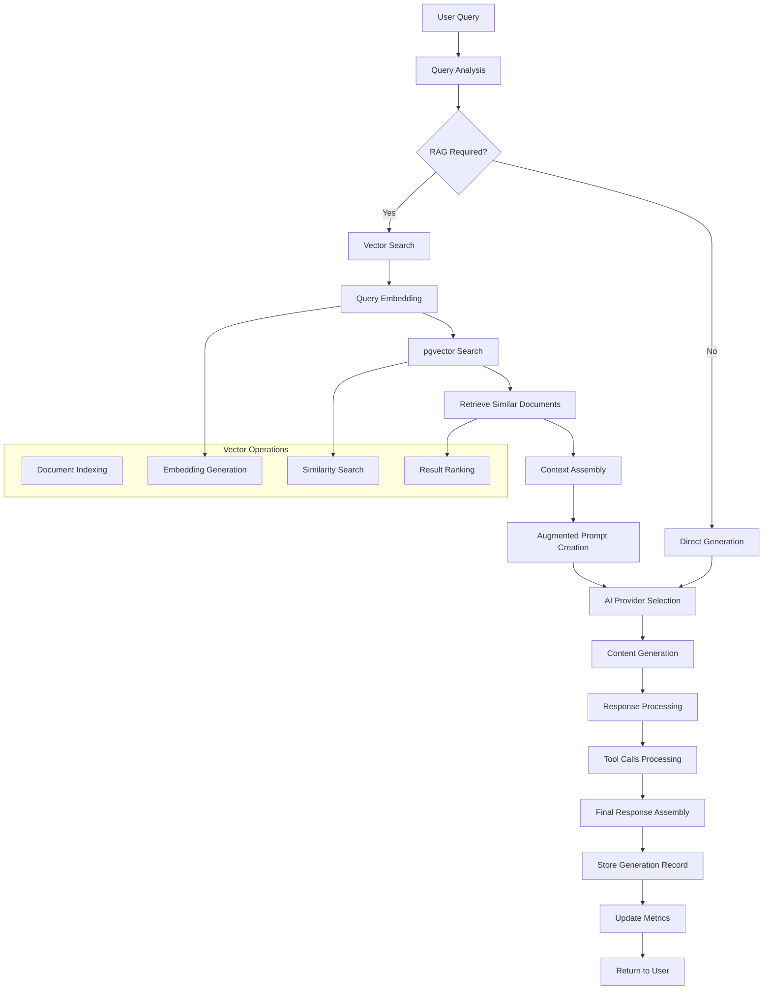
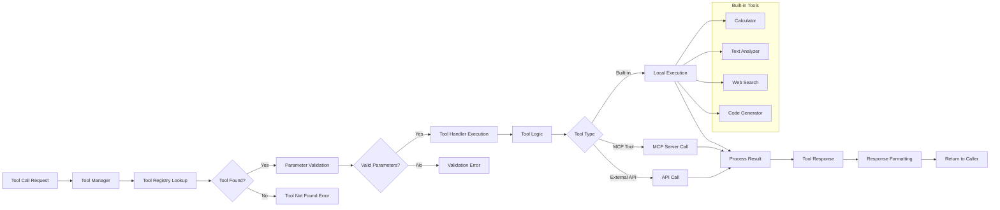
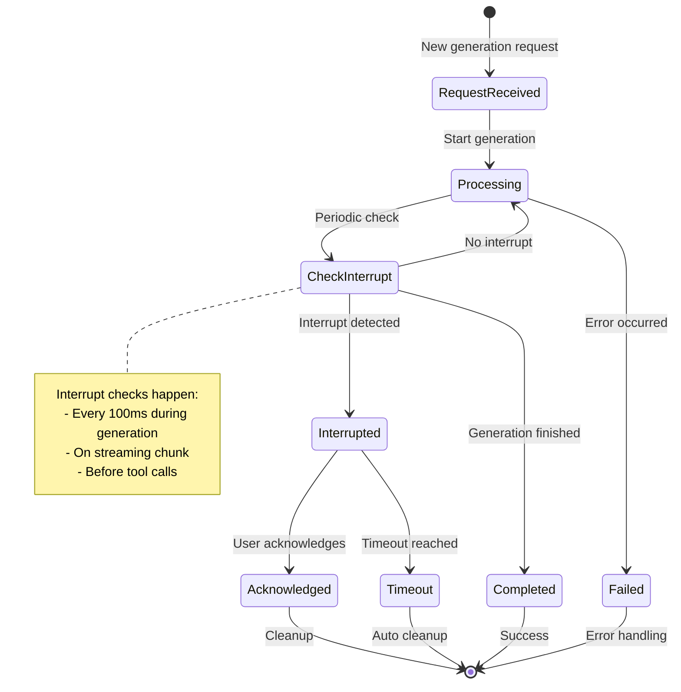
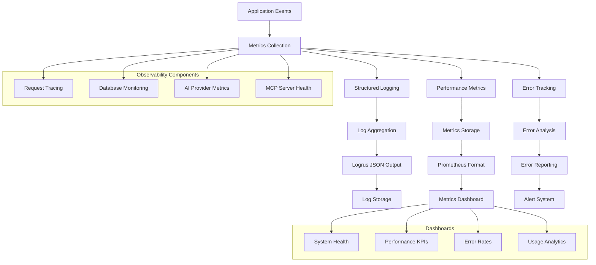
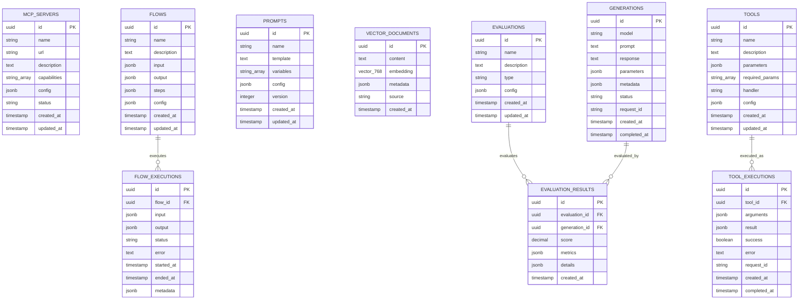
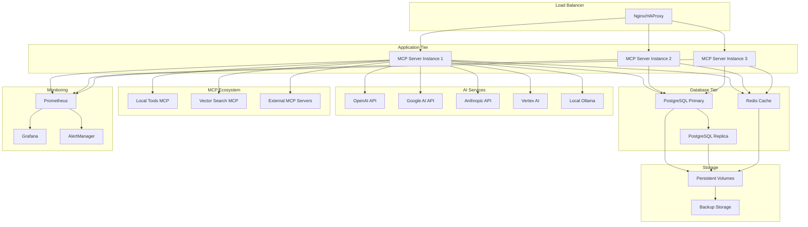

# MCP Octo Enigma - System Diagrams

This document contains Mermaid.js diagrams that illustrate the architecture and flow of the MCP Octo Enigma system.

## 1. Flow Control: Request Path from Controller to Database

## 2. Data Lineage: Variable Tracing Example

This diagram traces how a user prompt flows through the system to generate content and store vectors:

```mermaid
graph LR
    A[User Prompt Input] --> B[Handler Validation]
    B --> C[ContentService.GenerateContent]
    C --> D[Request Preparation]
    D --> E[Model Selection Logic]
    E --> F[AI Provider Router]
    
    F --> G[Genkit Service]
    G --> H[OpenAI Provider]
    H --> I[API Request Transformation]
    I --> J[OpenAI API Call]
    J --> K[Raw API Response]
    
    K --> L[Response Processing]
    L --> M[Content Extraction]
    M --> N[Usage Info Parsing]
    N --> O[Metadata Assembly]
    
    O --> P[Service Response Object]
    P --> Q[Database Storage]
    Q --> R[Generation Record]
    
    P --> S[Vector Processing]
    S --> T[Embedding Generation]
    T --> U[Vector Storage]
    U --> V[pgvector Table]
    
    P --> W[HTTP Response]
    W --> X[Client Response]
    
    subgraph "Transformation Points"
        Y[prompt → genkit.GenerateContentRequest]
        Z[openai.Response → genkit.GenerateContentResponse]
        AA[response → types.Generation]
        BB[content → vector embedding]
    end
```

## 3. Component Structure: Service Architecture

## 4. MCP Server Communication Flow

## 5. Content Generation with RAG Flow

## 6. Tool Calling Architecture

## 7. Interrupt Handling System

## 8. Observability and Metrics Flow

## 9. Database Schema Relationships

## 10. Deployment Architecture

These diagrams provide a comprehensive view of the MCP Octo Enigma system architecture, data flow, and component interactions. They can be rendered using any Mermaid.js compatible viewer or integrated into documentation platforms that support Mermaid syntax.