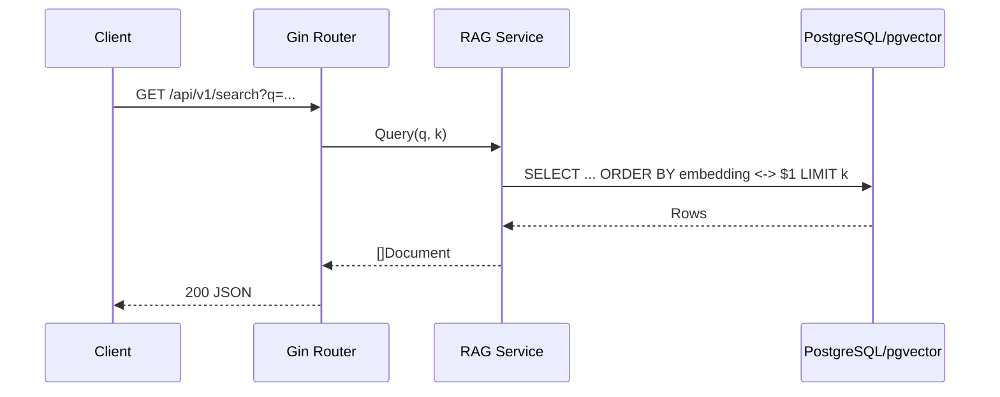
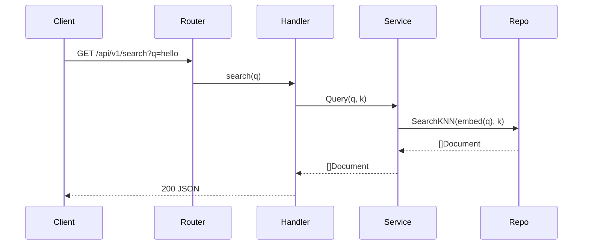
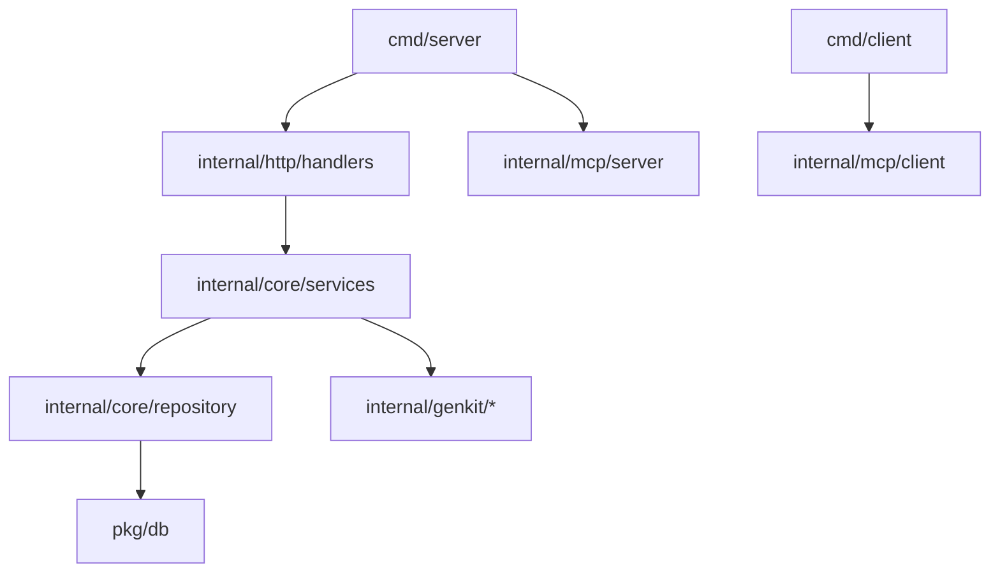

# mcp-octo-enigma

Go 1.24, Gin-based service scaffolding for MCP server and client, Genkit-ready stubs, and PostgreSQL/pgvector RAG.

## Diagrams

### Flow control

### Data lineage (endpoint.path)

### Structure

## Setup
- Env: SERVER_PORT, APP_ENV, DATABASE_URL
- Run: `go run ./cmd/server`
- Test: `go test ./...`

## Notes
- Genkit Go integrations (models, flows, dotprompt, tool-calling, interrupts) are stubbed pending SDK wiring.
- RAG uses pgvector; run migrations to create `documents`.
